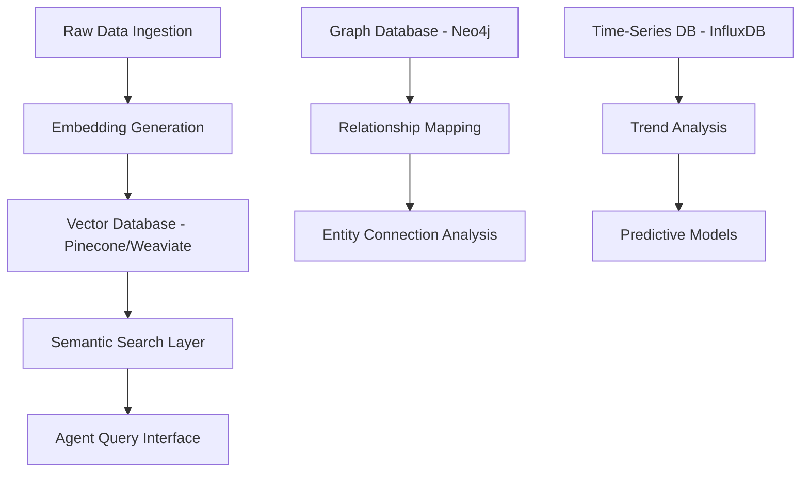

# 🚀 Comprehensive Modernization Roadmap: Multi-Agent Market Intelligence 2025+

This document outlines cutting-edge modernization strategies to transform the current MVP into a state-of-the-art enterprise-grade AI system for market intelligence.

## 📋 Executive Summary

**Current State**: MVP with basic agents and sequential processing  
**Target State**: Autonomous, cloud-native, multi-agent ecosystem with advanced AI reasoning  
**Timeline**: 18-24 months for full implementation  
**Expected Impact**: 50%+ reduction in manual intervention, 10x faster insights generation

---

## 🏗️ Core Architecture Modernization

### 1. Event-Driven Orchestration & Communication

#### **Current State vs. Future State**
| Current | Future |
|---------|---------|
| Sequential agent execution | Asynchronous event-driven processing |
| Basic Python function calls | Message queues with Apache Kafka/RabbitMQ |
| Manual error handling | Self-healing with auto-recovery |
| Single-threaded processing | Parallel agent collaboration |

#### **Implementation Priority**: 🔴 High
- **Phase 1**: Implement Apache Kafka for message streaming
- **Phase 2**: Integrate CrewAI or LangGraph for dynamic workflows
- **Phase 3**: Add self-healing mechanisms with circuit breakers
- **Phase 4**: Deploy agent-to-agent communication protocols

#### **Technology Stack**
```yaml
Message Queues: Apache Kafka, RabbitMQ, AWS SQS
Orchestration: CrewAI, LangGraph, Apache Airflow
Monitoring: Prometheus, Grafana, Jaeger
Error Recovery: Hystrix, Resilience4j
```

### 2. Foundation Model Integration

#### **Advanced LLM Architecture**
- **Primary Models**: GPT-4o, Claude 3.5 Sonnet, Gemini Pro
- **Reasoning Models**: OpenAI o1 for complex planning
- **Multimodal**: GPT-4V, Claude 3 Vision for image/video analysis
- **Specialized Models**: FinBERT (financial), LegalBERT (compliance)

#### **Implementation Strategy**
```python
# Example: Modern LLM Integration Architecture
class ModernLLMOrchestrator:
    def __init__(self):
        self.reasoning_model = OpenAI_O1()
        self.multimodal_model = GPT4_Vision()
        self.domain_models = {
            'financial': FinBERT(),
            'legal': LegalBERT(),
            'technical': CodeBERT()
        }
    
    async def process_complex_analysis(self, data):
        # Multi-model reasoning pipeline
        reasoning_plan = await self.reasoning_model.plan(data)
        domain_analysis = await self.analyze_by_domain(data)
        return self.synthesize_insights(reasoning_plan, domain_analysis)
```

### 3. Advanced Data Infrastructure

#### **Vector Database Architecture**


#### **Data Mesh Implementation**
- **Decentralized Ownership**: Each agent owns its data domain
- **Self-Serve Infrastructure**: Automated data pipeline provisioning
- **Data Products**: Standardized APIs for data consumption
- **Federated Governance**: Unified data quality and security policies

---

## 🤖 Advanced Agent Capabilities

### 4. Autonomous Decision-Making Systems

#### **AI-Powered Autonomy Framework**
```yaml
Autonomous Capabilities:
  Decision Making:
    - Rule-based automation (current) → ML-driven decisions
    - Manual approval workflows → Confidence-based auto-approval
    - Static thresholds → Dynamic, context-aware thresholds
  
  Predictive Analytics:
    - Historical analysis → Future trend prediction
    - Reactive alerts → Proactive recommendations
    - Single-point analysis → Multi-factor correlation
  
  Risk Assessment:
    - Manual compliance checks → Automated regulatory monitoring
    - Basic anomaly detection → Advanced pattern recognition
    - Point-in-time analysis → Continuous risk scoring
```

#### **Implementation Roadmap**
1. **Q1 2025**: Implement confidence scoring for decisions
2. **Q2 2025**: Deploy predictive models for trend forecasting
3. **Q3 2025**: Add automated compliance monitoring
4. **Q4 2025**: Full autonomous decision-making for low-risk scenarios

### 5. Enhanced Intelligence Features

#### **Semantic Analysis 2.0**
- **Context Understanding**: Transformer-based models for nuanced interpretation
- **Cross-Document Reasoning**: Connect insights across multiple sources
- **Temporal Analysis**: Track sentiment and trend evolution over time
- **Multi-Language Support**: Global market intelligence capabilities

#### **Advanced Entity Recognition**
```python
# Modern Entity Recognition Pipeline
class AdvancedEntityRecognition:
    def __init__(self):
        self.ner_model = SpaCy_Transformers()
        self.entity_linker = WikiData_Linker()
        self.relationship_extractor = RelationBERT()
    
    async def extract_entities(self, text):
        entities = await self.ner_model.extract(text)
        linked_entities = await self.entity_linker.link(entities)
        relationships = await self.relationship_extractor.extract(text, entities)
        return EntityGraph(entities, linked_entities, relationships)
```

### 6. Memory & Learning Systems

#### **Episodic and Semantic Memory Architecture**
```yaml
Memory System:
  Episodic Memory:
    - Store: Individual market events and agent experiences
    - Recall: Context-aware retrieval of similar past situations
    - Update: Continuous learning from new experiences
  
  Semantic Memory:
    - Store: General market knowledge and patterns
    - Structure: Knowledge graphs with entity relationships
    - Evolution: Dynamic updates based on new information
  
  Working Memory:
    - Context: Current analysis context and intermediate results
    - Attention: Focus on relevant information for current tasks
    - Integration: Combine episodic, semantic, and current data
```

---

## 🔧 Technical Infrastructure Upgrades

### 7. Cloud-Native Architecture

#### **Kubernetes-Based Microservices**
```yaml
# k8s-deployment.yaml
apiVersion: apps/v1
kind: Deployment
metadata:
  name: news-agent-service
spec:
  replicas: 3
  selector:
    matchLabels:
      app: news-agent
  template:
    spec:
      containers:
      - name: news-agent
        image: market-intel/news-agent:v2.0
        resources:
          requests:
            memory: "512Mi"
            cpu: "250m"
          limits:
            memory: "1Gi"
            cpu: "500m"
        env:
        - name: KAFKA_BROKER
          value: "kafka-service:9092"
        - name: VECTOR_DB_URL
          valueFrom:
            secretKeyRef:
              name: vector-db-secret
              key: url
```

#### **Auto-Scaling Configuration**
```yaml
apiVersion: autoscaling/v2
kind: HorizontalPodAutoscaler
metadata:
  name: news-agent-hpa
spec:
  scaleTargetRef:
    apiVersion: apps/v1
    kind: Deployment
    name: news-agent-service
  minReplicas: 2
  maxReplicas: 20
  metrics:
  - type: Resource
    resource:
      name: cpu
      target:
        type: Utilization
        averageUtilization: 70
  - type: Resource
    resource:
      name: memory
      target:
        type: Utilization
        averageUtilization: 80
```

### 8. Zero-Trust Security Architecture

#### **Security Framework**
```yaml
Security Layers:
  Identity & Access:
    - Agent-level authentication with OAuth 2.0/JWT
    - Role-based access control (RBAC)
    - Multi-factor authentication for sensitive operations
  
  Data Protection:
    - End-to-end encryption for all data in transit
    - Encryption at rest for sensitive market data
    - Key management with AWS KMS/Azure Key Vault
  
  Network Security:
    - Service mesh with mTLS (Istio/Linkerd)
    - Network policies for pod-to-pod communication
    - API gateway with rate limiting and DDoS protection
  
  Compliance & Auditing:
    - Automated compliance agents for GDPR/SOX
    - Comprehensive audit trails with blockchain verification
    - Data lineage tracking for regulatory reporting
```

### 9. Integration Ecosystem

#### **API-First Architecture**
```python
# Modern API Design with FastAPI
from fastapi import FastAPI, Depends, Security
from fastapi.security import HTTPBearer, HTTPAuthorizationCredentials

app = FastAPI(title="Market Intelligence API", version="2.0")
security = HTTPBearer()

@app.post("/api/v2/intelligence/analyze")
async def analyze_market_data(
    request: MarketAnalysisRequest,
    credentials: HTTPAuthorizationCredentials = Security(security)
):
    # Validate JWT token
    user = await validate_token(credentials.credentials)
    
    # Trigger multi-agent analysis
    analysis_task = await orchestrator.analyze_async(
        data=request.data,
        agents=request.required_agents,
        user_context=user
    )
    
    return {"task_id": analysis_task.id, "status": "processing"}

@app.websocket("/ws/intelligence/stream")
async def stream_intelligence(websocket: WebSocket):
    await websocket.accept()
    async for update in intelligence_stream:
        await websocket.send_json(update.dict())
```

#### **Enterprise Integration Connectors**
```yaml
Integration Catalog:
  CRM Systems:
    - Salesforce: Real-time lead scoring with market intelligence
    - HubSpot: Automated competitor tracking in deals
    - Microsoft Dynamics: Market trend integration in forecasting
  
  ERP Systems:
    - SAP: Supply chain risk assessment with market data
    - Oracle: Financial planning with market intelligence
    - NetSuite: Inventory optimization with demand forecasting
  
  Communication Platforms:
    - Slack: Real-time alerts and interactive commands
    - Microsoft Teams: Collaborative intelligence dashboards
    - Discord: Community sentiment monitoring
  
  Financial Data Feeds:
    - Bloomberg Terminal API: Professional financial data
    - Refinitiv Eikon: Global market data integration
    - Alpha Vantage: Stock and forex data for analysis
```

---

## 📊 Advanced Analytics & Visualization

### 10. Real-Time Intelligence Dashboards

#### **Modern Dashboard Architecture**
```typescript
// React-based Dashboard with Real-time Updates
import React, { useEffect, useState } from 'react';
import { useWebSocket } from 'react-use-websocket';
import { Chart as ChartJS } from 'chart.js/auto';
import { Line, Bar, Scatter } from 'react-chartjs-2';

const MarketIntelligenceDashboard: React.FC = () => {
  const [intelligence, setIntelligence] = useState<MarketIntelligence[]>([]);
  const { lastMessage } = useWebSocket('ws://api/intelligence/stream');

  useEffect(() => {
    if (lastMessage) {
      const update = JSON.parse(lastMessage.data);
      setIntelligence(prev => updateIntelligenceData(prev, update));
    }
  }, [lastMessage]);

  return (
    <div className="dashboard-container">
      <div className="grid grid-cols-3 gap-4">
        <TrendAnalysisWidget data={intelligence.trends} />
        <CompetitorTrackingWidget data={intelligence.competitors} />
        <SentimentAnalysisWidget data={intelligence.sentiment} />
      </div>
      <div className="full-width">
        <PredictiveModelsWidget forecasts={intelligence.predictions} />
      </div>
    </div>
  );
};
```

#### **AI-Powered Visualization Features**
- **Natural Language Queries**: "Show me competitor pricing trends for the last quarter"
- **Automatic Chart Selection**: AI chooses optimal visualization based on data type
- **Anomaly Highlighting**: Automatic detection and visual emphasis of outliers
- **Interactive Exploration**: Drill-down capabilities with context preservation

### 11. Advanced AI-Powered Insights

#### **Natural Language Generation Pipeline**
```python
class NLGReportGenerator:
    def __init__(self):
        self.llm = GPT4_Turbo()
        self.template_engine = JinjaTemplates()
        self.fact_checker = FactVerificationAgent()
    
    async def generate_market_report(self, intelligence_data):
        # Structure the narrative
        narrative_structure = await self.llm.generate_outline(intelligence_data)
        
        # Generate sections with fact-checking
        sections = []
        for section in narrative_structure:
            content = await self.llm.generate_content(section, intelligence_data)
            verified_content = await self.fact_checker.verify(content)
            sections.append(verified_content)
        
        # Compile final report
        return self.template_engine.render('market_report.html', {
            'sections': sections,
            'metadata': self.extract_metadata(intelligence_data)
        })
```

#### **Causal Analysis Engine**
```python
class CausalAnalysisEngine:
    def __init__(self):
        self.causal_model = DoWhy_CausalModel()
        self.time_series_analyzer = Prophet()
        
    async def analyze_market_drivers(self, market_data):
        # Identify potential causal relationships
        causal_graph = await self.causal_model.discover_graph(market_data)
        
        # Validate causal relationships
        validated_relationships = []
        for relationship in causal_graph.edges:
            estimate = self.causal_model.estimate_effect(
                treatment=relationship.cause,
                outcome=relationship.effect,
                data=market_data
            )
            if self.is_significant(estimate):
                validated_relationships.append({
                    'cause': relationship.cause,
                    'effect': relationship.effect,
                    'magnitude': estimate.value,
                    'confidence': estimate.confidence_interval
                })
        
        return CausalAnalysisResult(validated_relationships)
```

---

## 🎯 Implementation Priorities & Timeline

### Phase 1: Foundation (Months 1-6)
**Priority**: 🔴 Critical
```yaml
Infrastructure:
  - Containerize existing agents
  - Set up Kubernetes cluster
  - Implement basic message queuing with Kafka
  - Add vector database (Pinecone/Weaviate)

AI Integration:
  - Replace rule-based processing with GPT-4 API
  - Implement basic semantic search
  - Add simple autonomous decision-making

Security:
  - Basic authentication and authorization
  - API security with rate limiting
  - Data encryption in transit
```

### Phase 2: Intelligence Enhancement (Months 7-12)
**Priority**: 🟡 High
```yaml
Advanced AI:
  - Multi-model reasoning pipeline
  - Predictive analytics implementation
  - Advanced entity recognition and linking
  - Memory systems with episodic/semantic storage

Real-time Processing:
  - Event-driven architecture completion
  - Real-time dashboard development
  - Automated alert systems
  - Cross-source data correlation
```

### Phase 3: Autonomous Operations (Months 13-18)
**Priority**: 🟢 Medium
```yaml
Autonomy:
  - Self-healing systems
  - Autonomous decision-making for medium-risk scenarios
  - Continuous learning implementation
  - Advanced compliance automation

Analytics:
  - Causal analysis engine
  - Scenario modeling capabilities
  - Natural language report generation
  - ROI optimization recommendations
```

### Phase 4: Enterprise Scale (Months 19-24)
**Priority**: 🔵 Enhancement
```yaml
Scale & Performance:
  - Multi-cloud deployment
  - Advanced auto-scaling
  - Global data distribution
  - Performance optimization

Advanced Features:
  - Full autonomous operations
  - Advanced multimodal analysis
  - Predictive market modeling
  - AI-human collaboration interfaces
```

---

## 💰 Investment & ROI Analysis

### Technology Investment Breakdown
```yaml
Infrastructure (Annual):
  Cloud Computing: $50,000 - $200,000
  LLM API Costs: $30,000 - $100,000
  Vector Database: $20,000 - $80,000
  Message Queue/Streaming: $15,000 - $50,000

Development & Integration:
  Initial Development: $200,000 - $500,000
  Ongoing Maintenance: $100,000 - $300,000 annually
  Training & Certification: $20,000 - $50,000

Total Investment: $435,000 - $1,280,000 over 2 years
```

### Expected ROI
```yaml
Benefits:
  Operational Efficiency: 50%+ reduction in manual analysis time
  Decision Speed: 10x faster insights generation
  Market Response: 3-5 days faster competitive responses
  Risk Reduction: 30% improvement in early risk detection

Conservative ROI: 200-400% over 3 years
Optimistic ROI: 500-800% over 3 years
```

---

## 🚦 Success Metrics & KPIs

### Technical Metrics
- **System Performance**: <100ms response time for routine queries
- **Availability**: 99.9% uptime with auto-scaling
- **Accuracy**: >95% accuracy in trend prediction and sentiment analysis
- **Autonomy**: 70% of routine decisions handled without human intervention

### Business Impact Metrics
- **Time to Insight**: Reduce from days to hours
- **Market Coverage**: Monitor 10x more sources with same resources
- **Competitive Advantage**: Detect opportunities 5-7 days ahead of competitors
- **Cost Efficiency**: 60% reduction in manual intelligence gathering costs

---

## 🔮 Future Innovations (2026+)

### Emerging Technologies Integration
- **Quantum Computing**: For complex optimization problems
- **Brain-Computer Interfaces**: For intuitive analyst-AI collaboration
- **Extended Reality (XR)**: Immersive intelligence visualization
- **Neuromorphic Computing**: Energy-efficient AI processing
- **Federated Learning**: Privacy-preserving multi-organization intelligence

### Next-Generation Agent Capabilities
- **General Artificial Intelligence**: Human-level reasoning for strategic planning
- **Emotional Intelligence**: Understanding stakeholder emotions and motivations
- **Creative Problem Solving**: Generating novel solutions to market challenges
- **Ethical Decision Making**: Built-in ethical reasoning for responsible AI

---

## 📞 Implementation Support

For questions about implementing these modernization strategies:

1. **Technical Architecture**: Review the detailed implementation guides
2. **Technology Selection**: Evaluate options based on your specific requirements
3. **Timeline Planning**: Adapt the roadmap to your organization's constraints
4. **Investment Planning**: Use the ROI analysis for business case development

**Recommended Next Steps**:
1. Assess current technical capabilities and gaps
2. Prioritize modernization phases based on business impact
3. Establish development team with required expertise
4. Begin with Phase 1 foundation implementation
5. Plan for continuous iteration and improvement

---

*Last Updated: September 2025 | Version: 2.0*  
*Document Status: Strategic Planning | Implementation Ready*
