# 🏗️ Technical Architecture Diagrams: Multi-Agent Market Intelligence 2025+

This document contains comprehensive visual representations of the modernized multi-agent system architecture, including event-driven systems, microservices, and AI model integration.

---

## 📊 System Overview Architecture

### High-Level Architecture Diagram

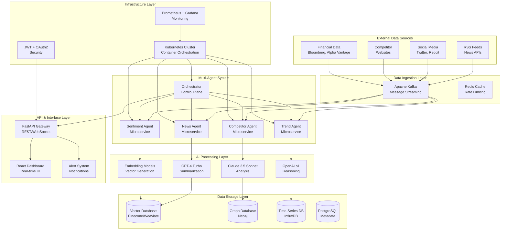

---

## 🤖 Agent Interaction Architecture

### Event-Driven Multi-Agent Communication

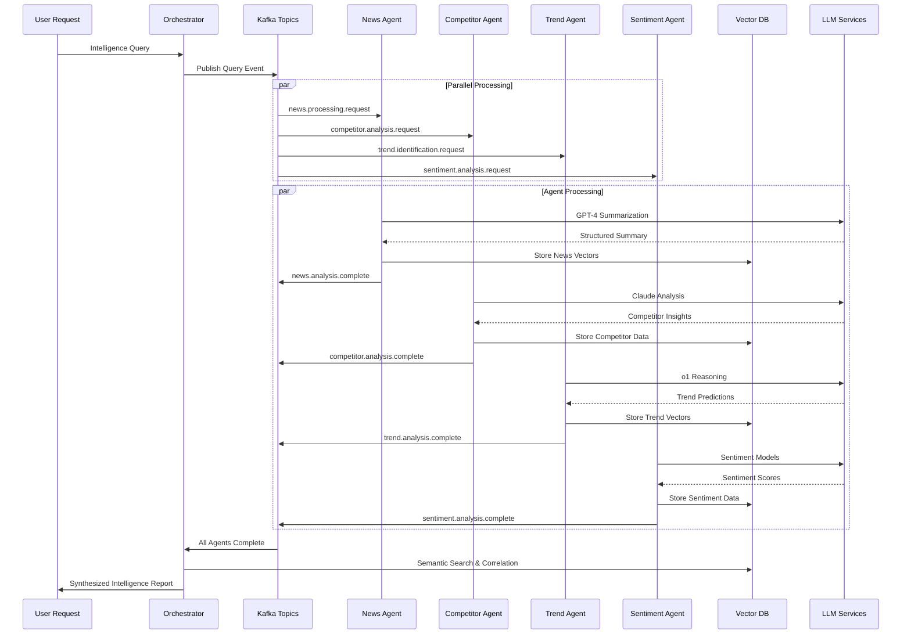

---

## 🏛️ Microservices Architecture

### Kubernetes-Native Deployment

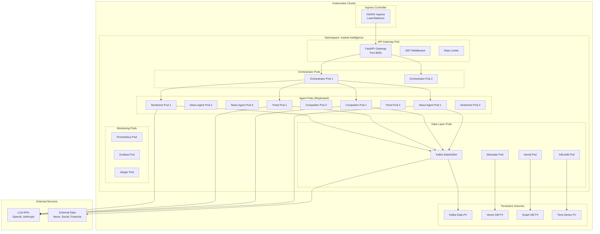

---

## 🧠 AI Model Integration Architecture

### Multi-Model AI Processing Pipeline

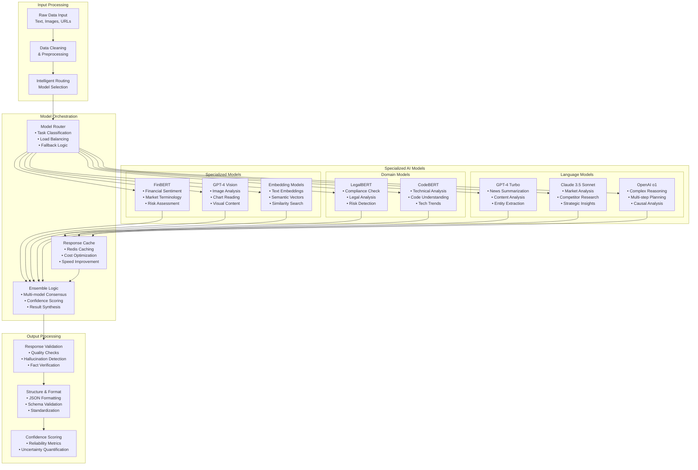

---

## 📊 Data Flow Architecture

### Real-Time Data Processing Pipeline

```mermaid
graph LR
    subgraph "Data Sources"
        NEWS_API[News APIs<br/>Reuters, AP, Bloomberg]
        SOCIAL_API[Social APIs<br/>Twitter, Reddit, LinkedIn]
        WEB_SCRAPER[Web Scrapers<br/>Competitor Sites]
        FINANCIAL[Financial APIs<br/>Alpha Vantage, IEX]
        INTERNAL[Internal Data<br/>CRM, Sales, Support]
    end
    
    subgraph "Ingestion Layer"
        COLLECTORS[Data Collectors<br/>Rate-Limited Scrapers]
        KAFKA_INGEST[Kafka Producers<br/>Topic: raw-data-stream]
        SCHEMA_REG[Schema Registry<br/>Data Validation]
    end
    
    subgraph "Stream Processing"
        KAFKA_STREAM[Kafka Streams<br/>Real-time Processing]
        DEDUP[Deduplication<br/>Duplicate Detection]
        ENRICH[Data Enrichment<br/>Metadata Addition]
        FILTER[Content Filtering<br/>Relevance Check]
    end
    
    subgraph "AI Processing"
        AI_QUEUE[AI Processing Queue<br/>Topic: ai-processing]
        BATCH_PROC[Batch Processor<br/>Efficiency Optimization]
        PRIORITY[Priority Queue<br/>Urgent vs Routine]
    end
    
    subgraph "Storage & Indexing"
        VECTOR_STORE[(Vector Database<br/>Semantic Search)]
        GRAPH_STORE[(Knowledge Graph<br/>Entity Relations)]
        TIME_SERIES[(Time-Series DB<br/>Trend Analysis)]
        OBJECT_STORE[(Object Storage<br/>Raw Documents)]
        CACHE_LAYER[(Redis Cache<br/>Hot Data)]
    end
    
    subgraph "Query & Retrieval"
        QUERY_ENGINE[Query Engine<br/>Multi-source Search]
        SEMANTIC_SEARCH[Semantic Search<br/>Vector Similarity]
        GRAPH_QUERY[Graph Queries<br/>Relationship Analysis]
        AGGREGATION[Data Aggregation<br/>Real-time Metrics]
    end
    
    NEWS_API --> COLLECTORS
    SOCIAL_API --> COLLECTORS
    WEB_SCRAPER --> COLLECTORS
    FINANCIAL --> COLLECTORS
    INTERNAL --> COLLECTORS
    
    COLLECTORS --> KAFKA_INGEST
    KAFKA_INGEST --> SCHEMA_REG
    SCHEMA_REG --> KAFKA_STREAM
    
    KAFKA_STREAM --> DEDUP
    DEDUP --> ENRICH
    ENRICH --> FILTER
    FILTER --> AI_QUEUE
    
    AI_QUEUE --> BATCH_PROC
    AI_QUEUE --> PRIORITY
    BATCH_PROC --> VECTOR_STORE
    PRIORITY --> VECTOR_STORE
    
    VECTOR_STORE --> CACHE_LAYER
    VECTOR_STORE --> QUERY_ENGINE
    GRAPH_STORE --> GRAPH_QUERY
    TIME_SERIES --> AGGREGATION
    
    QUERY_ENGINE --> SEMANTIC_SEARCH
    SEMANTIC_SEARCH --> GRAPH_QUERY
    GRAPH_QUERY --> AGGREGATION
```

---

## 🔐 Security Architecture

### Zero-Trust Security Model

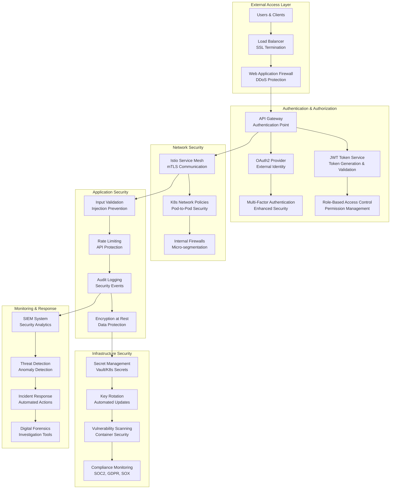

---

## 📈 Monitoring & Observability Architecture

### Comprehensive System Monitoring

```mermaid
graph TB
    subgraph "Application Layer"
        AGENTS[AI Agents<br/>News, Competitor, Trend, Sentiment]
        ORCH[Orchestrator<br/>Control Plane]
        API_GW[API Gateway<br/>External Interface]
        WEBAPP[Web Application<br/>User Interface]
    end
    
    subgraph "Infrastructure Layer"
        K8S[Kubernetes<br/>Container Platform]
        NODES[Worker Nodes<br/>Compute Resources]
        STORAGE[Storage Systems<br/>Persistent Volumes]
        NETWORK[Network Layer<br/>Service Mesh]
    end
    
    subgraph "Data Services"
        KAFKA[Apache Kafka<br/>Message Streaming]
        DATABASES[Databases<br/>Vector, Graph, SQL]
        CACHE[Redis Cache<br/>Memory Store]
        AI_APIS[AI APIs<br/>OpenAI, Anthropic]
    end
    
    subgraph "Metrics Collection"
        PROM[Prometheus<br/>Metrics Server]
        NODE_EXP[Node Exporter<br/>System Metrics]
        APP_METRICS[Application Metrics<br/>Custom Gauges]
        AI_METRICS[AI Metrics<br/>Token Usage, Response Time]
    end
    
    subgraph "Logging"
        FLUENTD[Fluentd<br/>Log Collector]
        ELASTIC[Elasticsearch<br/>Log Storage]
        KIBANA[Kibana<br/>Log Analysis]
        LOKI[Loki<br/>Log Aggregation]
    end
    
    subgraph "Tracing"
        JAEGER[Jaeger<br/>Distributed Tracing]
        OTEL[OpenTelemetry<br/>Trace Collection]
        SPAN_PROC[Span Processor<br/>Trace Analysis]
    end
    
    subgraph "Visualization & Alerting"
        GRAFANA[Grafana<br/>Dashboards & Alerts]
        ALERT_MGR[Alert Manager<br/>Notification Routing]
        SLACK_INT[Slack Integration<br/>Team Notifications]
        PAGER[PagerDuty<br/>Incident Management]
    end
    
    subgraph "AI-Specific Monitoring"
        MODEL_PERF[Model Performance<br/>Accuracy, Latency]
        COST_TRACK[Cost Tracking<br/>API Usage, Compute]
        BIAS_DETECT[Bias Detection<br/>Fairness Metrics]
        DRIFT_DETECT[Model Drift<br/>Performance Degradation]
    end
    
    AGENTS --> APP_METRICS
    ORCH --> APP_METRICS
    API_GW --> APP_METRICS
    WEBAPP --> APP_METRICS
    
    K8S --> NODE_EXP
    NODES --> NODE_EXP
    STORAGE --> NODE_EXP
    NETWORK --> NODE_EXP
    
    KAFKA --> PROM
    DATABASES --> PROM
    CACHE --> PROM
    AI_APIS --> AI_METRICS
    
    APP_METRICS --> PROM
    NODE_EXP --> PROM
    AI_METRICS --> PROM
    
    AGENTS --> FLUENTD
    ORCH --> FLUENTD
    K8S --> FLUENTD
    FLUENTD --> ELASTIC
    FLUENTD --> LOKI
    ELASTIC --> KIBANA
    
    AGENTS --> OTEL
    ORCH --> OTEL
    API_GW --> OTEL
    OTEL --> JAEGER
    JAEGER --> SPAN_PROC
    
    PROM --> GRAFANA
    ELASTIC --> GRAFANA
    JAEGER --> GRAFANA
    
    GRAFANA --> ALERT_MGR
    ALERT_MGR --> SLACK_INT
    ALERT_MGR --> PAGER
    
    AI_APIS --> MODEL_PERF
    AI_APIS --> COST_TRACK
    AI_METRICS --> BIAS_DETECT
    MODEL_PERF --> DRIFT_DETECT
    
    MODEL_PERF --> GRAFANA
    COST_TRACK --> GRAFANA
    BIAS_DETECT --> GRAFANA
    DRIFT_DETECT --> ALERT_MGR
```

---

## 🚀 Deployment Pipeline Architecture

### CI/CD and Infrastructure as Code

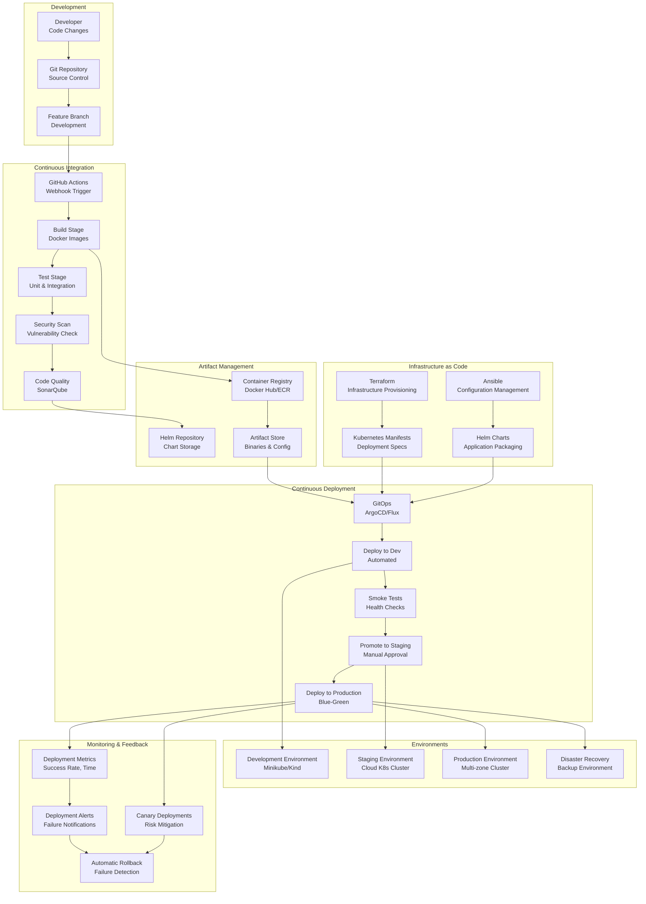

---

## 🎯 Performance & Scalability Architecture

### Auto-Scaling and Load Distribution

```mermaid
graph TB
    subgraph "Load Balancing Layer"
        EXT_LB[External Load Balancer<br/>Cloud Provider]
        INGRESS[NGINX Ingress Controller<br/>SSL Termination]
        SERVICE_LB[Kubernetes Services<br/>Internal Load Balancing]
    end
    
    subgraph "Auto-Scaling Components"
        HPA[Horizontal Pod Autoscaler<br/>CPU/Memory Based]
        VPA[Vertical Pod Autoscaler<br/>Resource Optimization]
        CA[Cluster Autoscaler<br/>Node Scaling]
        CUSTOM_HPA[Custom HPA<br/>Queue Length, AI Metrics]
    end
    
    subgraph "Application Pods (Scalable)"
        subgraph "News Agent Cluster"
            NEWS_1[News Pod 1]
            NEWS_2[News Pod 2]
            NEWS_N[News Pod N<br/>Auto-scaled]
        end
        
        subgraph "Competitor Agent Cluster"
            COMP_1[Competitor Pod 1]
            COMP_2[Competitor Pod 2]
            COMP_N[Competitor Pod N<br/>Auto-scaled]
        end
        
        subgraph "API Gateway Cluster"
            API_1[API Gateway Pod 1]
            API_2[API Gateway Pod 2]
            API_N[API Gateway Pod N<br/>Auto-scaled]
        end
    end
    
    subgraph "Data Layer Scaling"
        KAFKA_CLUSTER[Kafka Cluster<br/>Multi-Broker]
        VECTOR_CLUSTER[Vector DB Cluster<br/>Sharded Storage]
        CACHE_CLUSTER[Redis Cluster<br/>Distributed Cache]
        DB_READ_REPLICAS[Database Read Replicas<br/>Query Distribution]
    end
    
    subgraph "AI Processing Scaling"
        AI_POOL[AI Request Pool<br/>Load Balancing]
        BATCH_PROC[Batch Processing<br/>Cost Optimization]
        PRIORITY_QUEUE[Priority Queues<br/>SLA Management]
        CIRCUIT_BREAKER[Circuit Breakers<br/>Fault Tolerance]
    end
    
    subgraph "Performance Optimization"
        CACHING[Multi-Level Caching<br/>Redis + CDN]
        COMPRESSION[Data Compression<br/>Bandwidth Optimization]
        CONNECTION_POOL[Connection Pooling<br/>Database Efficiency]
        ASYNC_PROC[Async Processing<br/>Non-blocking I/O]
    end
    
    subgraph "Monitoring & Metrics"
        PERF_METRICS[Performance Metrics<br/>Response Time, Throughput]
        RESOURCE_MON[Resource Monitoring<br/>CPU, Memory, Disk]
        COST_OPT[Cost Optimization<br/>Right-sizing, Scheduling]
        SLA_MON[SLA Monitoring<br/>Availability, Latency]
    end
    
    EXT_LB --> INGRESS
    INGRESS --> SERVICE_LB
    SERVICE_LB --> API_1
    SERVICE_LB --> API_2
    SERVICE_LB --> API_N
    
    HPA --> NEWS_N
    HPA --> COMP_N
    HPA --> API_N
    VPA --> NEWS_1
    VPA --> COMP_1
    CA --> NEWS_N
    CA --> COMP_N
    
    CUSTOM_HPA --> HPA
    PERF_METRICS --> CUSTOM_HPA
    
    API_1 --> KAFKA_CLUSTER
    NEWS_1 --> VECTOR_CLUSTER
    COMP_1 --> CACHE_CLUSTER
    
    NEWS_1 --> AI_POOL
    COMP_1 --> AI_POOL
    AI_POOL --> BATCH_PROC
    AI_POOL --> PRIORITY_QUEUE
    AI_POOL --> CIRCUIT_BREAKER
    
    CACHE_CLUSTER --> CACHING
    KAFKA_CLUSTER --> COMPRESSION
    VECTOR_CLUSTER --> CONNECTION_POOL
    AI_POOL --> ASYNC_PROC
    
    NEWS_1 --> PERF_METRICS
    COMP_1 --> RESOURCE_MON
    API_1 --> COST_OPT
    SERVICE_LB --> SLA_MON
    
    PERF_METRICS --> HPA
    RESOURCE_MON --> VPA
    COST_OPT --> CA
```

---

## 📊 Business Intelligence & Analytics Architecture

### Advanced Analytics and Reporting

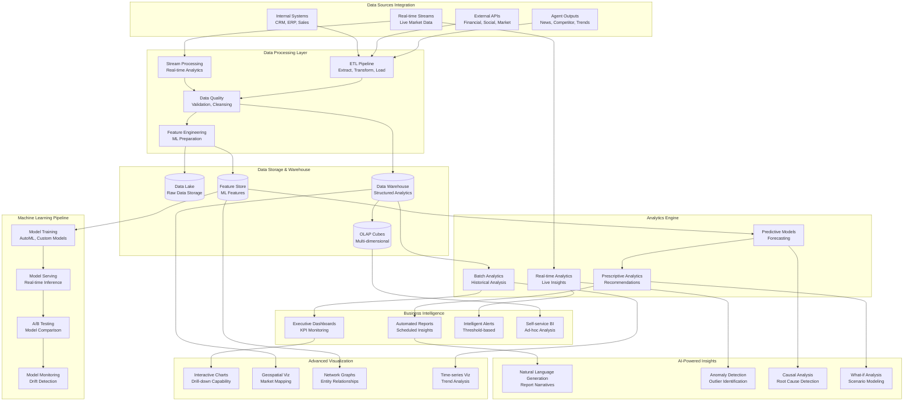

---

## 🔄 Integration Architecture

### Enterprise System Integration

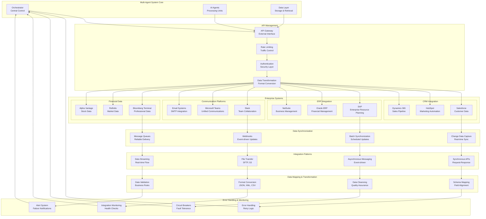

---

## 📱 User Interface Architecture

### Modern Web Application Stack

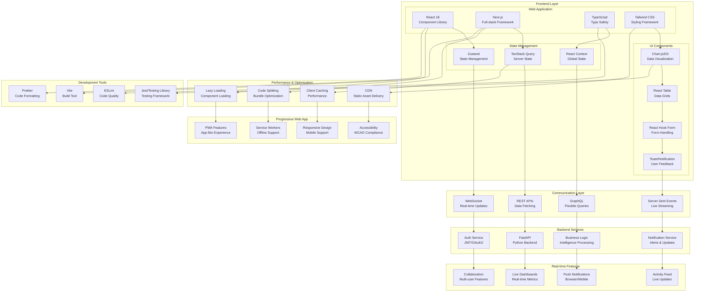

---

## 🎯 Summary

These technical architecture diagrams provide comprehensive visual representations of the modernized multi-agent market intelligence system, covering:

1. **System Overview**: High-level architecture with all major components
2. **Agent Interactions**: Event-driven communication patterns
3. **Microservices**: Kubernetes-native deployment architecture
4. **AI Integration**: Multi-model processing pipeline
5. **Data Flow**: Real-time data processing and storage
6. **Security**: Zero-trust security implementation
7. **Monitoring**: Comprehensive observability stack
8. **Deployment**: CI/CD and infrastructure as code
9. **Performance**: Auto-scaling and load distribution
10. **Business Intelligence**: Advanced analytics architecture
11. **Integration**: Enterprise system connectivity
12. **User Interface**: Modern web application stack

Each diagram is designed to be implementation-ready, providing clear guidance for the development team during the modernization process.

---

*Document Version: 1.0*  
*Last Updated: September 2025*  
*Status: Implementation Ready*
